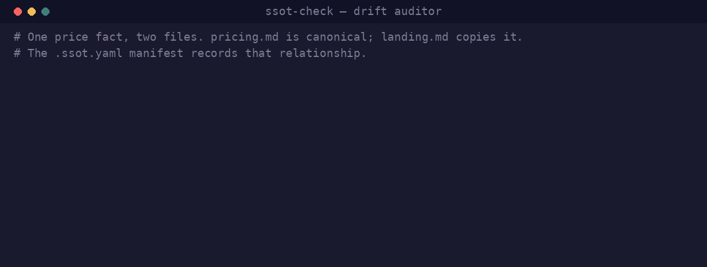

# ssot-check

**Single-source-of-truth drift auditor for documentation-heavy repos.**

<p align="center">
  
</p>

A deterministic, dependency-free CLI (plus a skill wrapper, a pre-commit hook,
and a GitHub Action) that catches facts hand-copied across files and gone stale.

## The problem

Docs repeat facts. A price lives in `pricing.md`, then gets hand-copied into a
media kit, a landing page, and a README. Someone updates the price in one place.
The copies drift — and nobody notices until a customer does.

`ssot-check` records where each fact's canonical value lives in a `.ssot.yaml`
manifest, then verifies every copy against it on each run. One canonical,
everything else is a copy. Drift is reported with exact `file:line` locations and
a proposed value — never a silent edit.

It is deterministic: values are extracted with one-capture-group regexes and
compared exactly (after typed normalization). There is no fuzzy matching — a
mismatch always means something is wrong.

## Quickstart

```bash
# 1. DISCOVER — scan prose for drift-prone facts (read-only; writes nothing).
python3 ssot_check.py discover --root .

# 2. CURATE — turn the proposals into a manifest by hand (see the reference
#    below and .ssot.example.yaml). Assign one canonical per fact.
cp .ssot.example.yaml .ssot.yaml   # then edit

# 3. CHECK — verify every copy matches its canonical.
python3 ssot_check.py check
```

`check` exits `0` when everything is in sync, `1` when drift or staleness is
found, and `2` on a manifest/config error — ready for a pre-commit hook or CI.

No installation and no dependencies: it is a single stdlib-only file. Python 3.9+.

## CLI reference

```
python3 ssot_check.py <command> [options]

  check      (default) verify copies against canonicals
  validate   structural check of the manifest against the schema
  discover   propose drift-prone facts from prose (writes nothing)
  explain    show one fact's canonical value and all copies
```

Common options (`check`, `validate`, `explain`):

| Option | Meaning |
|--------|---------|
| `-f, --manifest PATH` | Manifest path (default `.ssot.yaml`). |
| `--root DIR` | Repo root for relative paths (default: the manifest's directory). |
| `--json` | Machine-readable output (`check`, `discover`, `explain`). |
| `--fetch` | For cross-repo copies, run `git fetch` in the sibling repo and compare against its remote-tracking ref. Makes a network call and updates that repo's remote-tracking refs and `FETCH_HEAD`; never pulls, rebases, or touches its working tree. Off by default. `check`/`explain`. |

`discover` takes `--root DIR` (default `.`), repeatable `--ignore GLOB`, and
`--json`. Running `ssot_check.py` with no subcommand defaults to `check`.

Exit codes (`check`): `0` in sync · `1` drift, canonical moved, stale entry,
unverified copy, or stale-past-freshness canonical · `2` manifest missing,
unparseable, or schema-invalid.

### Statuses in a check report

- **IN SYNC** — copy matches canonical.
- **DRIFTED** — copy no longer matches; shows canonical value, copy value, and
  `file:line`. A `(canonical suspect)` tag appears when a `monotonic` fact's copy
  is numerically higher than its canonical (the canonical is probably the stale
  side — confirm before regressing the copy).
- **CANONICAL MOVED** — the canonical pattern no longer matches its file. The
  manifest is stale.
- **STALE MANIFEST ENTRY** — a copy pattern no longer matches (reworded/removed).
- **UNVERIFIED** — a cross-repo copy could not be read.
- **STALE CANONICAL (freshness)** — the canonical file has not been edited within
  `max_age_days`.

## Manifest reference

`.ssot.yaml` lives at the repo root. Annotated template: [`.ssot.example.yaml`](.ssot.example.yaml).
Formal schema for editors/CI: [`schema/ssot.schema.json`](schema/ssot.schema.json).

```yaml
# Globs excluded from globbed-copy expansion and from `discover` scans.
ignore_paths:
  - "vendor/**"

facts:
  - name: user-count            # kebab-case identifier (required)
    type: integer               # string|integer|currency|semver|date (default: string)
    note: >                     # optional: what it is, cadence, counting convention
      Active users, excluding trial accounts.
    monotonic: true             # optional: flag "canonical suspect" if a copy is higher
    freshness:                  # optional: warn when the canonical file goes stale
      owner: growth-team
      max_age_days: 30
    canonical:                  # where the true value lives (required)
      file: docs/metrics.md
      pattern: 'Active users:\s*([\d,]+)'   # regex, EXACTLY one capture group
    copies:                     # every other place the value is written (required, >=1)
      - file: README.md
        pattern: '([\d,]+) users trust'
      - file: marketing/site.html
        pattern: 'data-stat="users">([\d,]+)\+?<'
        rounding: floor-1000    # optional per-copy transform (see below)
        note: auto-written by scripts/metrics.py
```

### Fields

- **`name`** (required) — short kebab-case identifier.
- **`type`** — normalization applied before comparison:
  - `string` (default): literal. Strips surrounding whitespace and a single
    trailing `+`; nothing else. `1,234` ≠ `1234` under `string` — use `integer`.
  - `integer`: strips thousands separators (`,` `_` whitespace) and a trailing
    `+`, compares numerically. `1,234` == `1234` == `1234+`.
  - `currency`: strips a leading currency symbol (`$ € £ ¥`), separators, and a
    trailing `+`; compares numerically (decimals allowed). Does **not** expand
    magnitude suffixes — `$5k` is not a currency amount; keep it `string`.
  - `semver`: ignores a leading `v`. `v1.2.3` == `1.2.3`.
  - `date`: parses common formats (`2026-07-13`, `07/13/2026`, `July 13, 2026`,
    …) to a calendar date and compares.
- **`monotonic`** — for counts that only grow. If a copy is numerically higher
  than the canonical, the drift is tagged `canonical suspect`.
- **`freshness`** `{owner, max_age_days}` — checks the canonical file's git
  last-edit date (`git log -1 --format=%cs`). Older than `max_age_days` →
  reported (and exits `1`). Skipped with a note when not in a git repo.
- **`canonical`** (required) — `{file, pattern}`. The true value and how to
  extract it.
- **`copies`** (required, ≥1) — every other `{file, pattern}`. Optional per copy:
  - **`note`** — free text.
  - **`rounding`** — a deterministic transform applied to the *canonical* value
    before an exact compare, for copies a script intentionally rounds:
    `floor-10`, `floor-100`, `floor-1000` (floor to that multiple), or
    `floor-1000-as-K` (floor to thousands; compare against a value written as
    `NNN`, e.g. canonical `156703` matches copy `156`). Not fuzzy — a mismatch
    still means something is wrong (usually sync lag).

### Patterns

- Exactly **one capture group** per pattern (`validate` enforces this). The check
  compares captured strings, not whole lines.
- Patterns match against the **whole file content**, not line by line — so a
  value and its label on different lines can be matched by anchoring on a stable
  attribute and letting `\s*` cross the break. If a pattern matches more than
  once, the first match is used and a warning is emitted.
- Put regexes in **single-quoted** YAML strings so backslashes survive.

### Globbed copies

A local copy `file` may be a glob (`docs/guides/*.md`); every matching file is
checked with the same pattern. Files matching `ignore_paths` are excluded.
Globbing is not applied to cross-repo paths.

### Cross-repo copies (never edited; `--fetch` is the one write)

A copy — or the canonical — may live in a sibling clone via a path that escapes
the repo root (`../marketing-site/pricing.html`) or an absolute path. These are
never edited. `ssot-check` reports drift in a sibling repo; it never fixes it.

**By default**, the sibling's working-tree file is read and nothing in that repo
is touched — no network call, no git command that writes.

**With `--fetch`**, and if the sibling is a git repo, `ssot-check` runs
`git fetch` there and compares against its remote-tracking ref
(`branch@{upstream}`, else `origin/HEAD`) via `git show`. Be clear about the
cost, because it is the tool's entire write surface:

| `--fetch` does | `--fetch` does not |
|---|---|
| make a network call | pull, rebase, or merge |
| update the sibling's remote-tracking refs, `FETCH_HEAD`, and object store | move its working tree, index, `HEAD`, or any local branch |
| | write any file, anywhere |

The report labels each cross-repo value with its ref and tip date — e.g.
`remote origin/main @ 2026-07-28`. If the fetch itself fails (offline, auth, no
remote), the value still comes from whatever refs were on disk and is labelled
`fetch failed; local mirror may be stale`, so a stale mirror can't pass as a
fresh one.

Local divergence between the sibling's working tree and its remote-tracking ref
is reported, not fixed. If the value can't be established — the file is
unreadable, or the sibling has no remote-tracking ref — the fact is reported
**UNVERIFIED** rather than guessed.

## YAML subset — what the parser supports

`ssot-check` has no third-party dependencies, so it ships a small, tested parser
for a **subset** of YAML — enough for the manifest, not a general YAML loader.

**Supported:** block mappings (`key: value`), block sequences (`- item`) of
scalars or mappings, nested blocks (indented *strictly more* than their key),
bare / single-quoted (`''` escapes a quote) / double-quoted scalars, folded
(`>`) and literal (`|`) block scalars, and quote-aware comments (full-line and
trailing `# …`).

**Not supported** (avoid in `.ssot.yaml`): flow collections (`{a: 1}`, `[1, 2]`),
anchors/aliases (`&`/`*`), explicit tags (`!!str`), multiple documents (`---`),
sequence items on the same line as their key, and tab indentation (use spaces).
`validate` reports a friendly error with a line number when the manifest strays
outside the subset.

## Skill wrapper

[`SKILL.md`](SKILL.md) is a thin, model-invocable [agent skill](https://code.claude.com/docs/en/skills)
around the CLI. The CLI does the deterministic work; the skill adds judgment —
helping a human curate a manifest from `discover` output and interpreting a
`check` report. The CLI never edits docs or the manifest; the only state it can
change is a sibling repo's remote-tracking refs, under `--fetch`.
Writing `.ssot.yaml` and applying fixes are human-gated (propose, approve, then
write). Drop the repo (or `SKILL.md` plus `ssot_check.py`) into `.claude/skills/`.

## Pre-commit hook

[`hooks/pre-commit`](hooks/pre-commit) runs `check` before each commit.

```bash
cp hooks/pre-commit .git/hooks/pre-commit && chmod +x .git/hooks/pre-commit
# or:  git config core.hooksPath hooks
```

Soft-fail by default (prints drift, lets the commit through). Set `SSOT_STRICT=1`
to make drift block the commit.

## GitHub Action

[`action.yml`](action.yml) is a composite action that runs `check` and fails the
build on drift. Checkout is assumed to have run already.

```yaml
jobs:
  ssot:
    runs-on: ubuntu-latest
    steps:
      - uses: actions/checkout@v4
      - uses: conorbronsdon/ssot-check@v0.1.0
        with:
          manifest: .ssot.yaml   # optional (default)
```

## Development

```bash
python3 -m unittest discover tests   # stdlib only; no install step
```


## Disclaimer

*This is an independent personal project, not affiliated with, sponsored by, or endorsed by any company. All views expressed are my own.*

## License

MIT — see [LICENSE](LICENSE).
